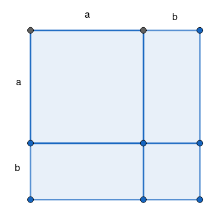

% Factoring Part 3
% David Sellers
% Spring 2025

## Completing the Square

Given $a^{2} + 2ab + c$ we can make this into a perfect square trinomial plus a constant by adding and subtracting some number, similar to $4=4+2-2.$ For the given polynomial, we can do the following:

$$
\begin{array}{cc}
a^{2} + 2ab + c\\
(\frac{2ab}{2a})^{2} &= b^{2}\\
a^{2} + 2ab + c &= a^{2} + 2ab + b^{2} - b^{2} + c\\
\end{array}
$$

We can use these two previous arguments to develop a method for completing the square. Remember that the linear term contains information about both terms in the binomial that is squared. So if we can remove the information about the first term from the linear term it will only contain information about the second term.

If we take a quadratic equation of the form $ax^{2}+bx$ and we want to guarantee that it factors into the form $(a \pm b)^{2}$ then we can complete the square in order to create a perfect square trinomial. We first want to identify what $b$ is in the **binomial** not the trinomial. From the linear term, we can deduce what this is. First we want to divide the linear term by twice the square root of the quadratic term, $\frac{bx}{2ax}$, why? Note: traditionally we ignore the $x$ in this process and only divide $\frac{b}{2a}$, but for a more complete discussion I included it here.

This will identify the square root of the constant that must be added. But since we are trying to make a perfect square trinomial we need the last term to be a perfect square, so we square it. And lastly, since if we add a number the expression is no longer equal so we must also subtract it.

$$3x^{2}+5x$$

Realistically, this will often lead to expressions that are difficult to work with, so we will continue working these problems by first dividing by the coefficient of the quadratic term.

$$3x^{2}+5x$$

Try these, complete the square and factor:

- $x^{2}+4x$
- $x^{2}-11x$
- $4x^{2}-8x$
- $3x^{2}+5x$
- $2x^{2}+3x+5$
- $x^{2}+12x+40$

[<< previous](./day8.html) [Home](../../index.html) [next >>](./day10.html)
